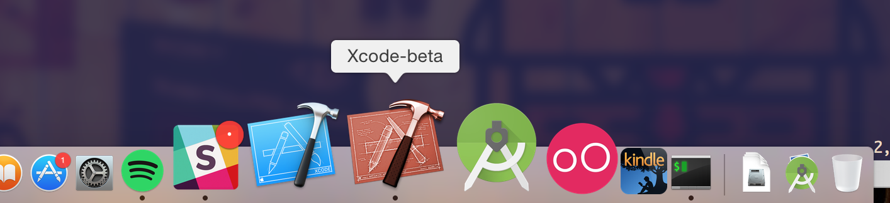

It is quite common when working in iOS, tvOS or macOS projects to have installed the next Xcode beta in order to adapt your Applications as soon as possible. 

Due to the fact that the UI of the stable and beta versions of Xcode do no change too much nowadays, sharing even the same icon, it is quite simple to mix them up.

With these tips you could palliate the problem:

# Red icon for Xcode-beta

Copy the file XCodeBeta.icns, that you can find in the root path of this repo, to this path in your local machine /Applications/Xcode-beta.app/Contents/Resources/XcodeBeta.icns

```
$ git clone https://github.com/dcordero/BetafyXcode.git
$ cp BetafyXcode/XcodeBeta.icns /Applications/Xcode-beta.app/Contents/Resources/XcodeBeta.icns
```


